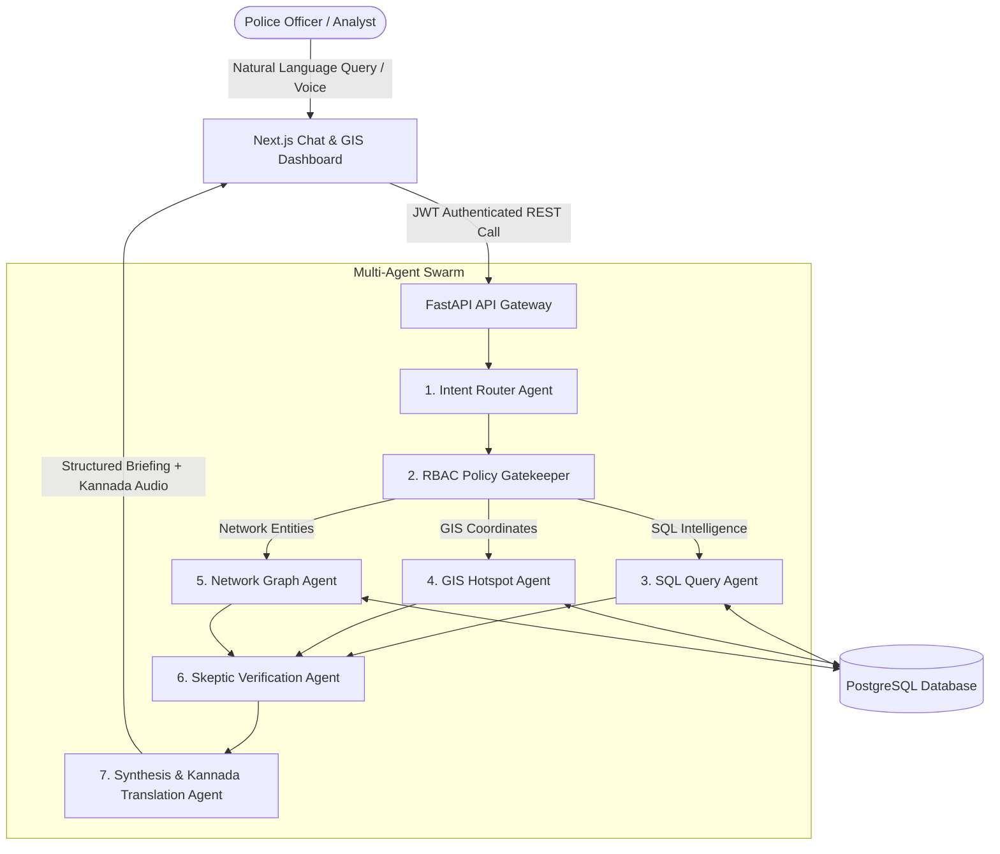

# 🛡️ PRAMANA — AI-Powered Law Enforcement & Crime Intelligence Platform

[](https://www.python.org/)
[](https://fastapi.tiangolo.com/)
[](https://nextjs.org/)
[](https://www.postgresql.org/)
[](https://ai.google.dev/)
[](https://www.typescriptlang.org/)
[](LICENSE)

---

## 📌 Executive Summary

**PRAMANA** is an enterprise-grade AI decision-support and crime intelligence platform developed for **Karnataka State Police (KSP)**. Built on a decentralized **Multi-Agent AI Architecture**, PRAMANA ingests vast volumes of First Information Reports (FIRs), accident data, criminal registries, and station logs, allowing police commanders, inspectors, and field officers to perform instant natural language intelligence queries, visualize criminal syndicates, and analyze geographic crime hotspots in real time.

---

## 🔥 Key Capabilities

### 🤖 1. Autonomous Multi-Agent AI Pipeline
PRAMANA employs a swarm of specialized AI agents built with **Google Gemini 2.5 Flash**:
* **Intent Router Agent**: Classifies incoming natural language queries into specific operational sub-domains (SQL Analytics, GIS Hotspots, Criminal Networks, General Inquiry).
* **RBAC Enforcement Agent**: Intercepts queries to inject row-level and column-level security constraints based on officer credentials.
* **SQL Query Agent**: Generates optimized PostgreSQL queries, handling complex aggregations, time-series trends, and district-level crime statistics.
* **GIS Hotspot Agent**: Calculates spatial crime density, normalizes geographic coordinates within Karnataka boundaries, and returns GeoJSON data for tactical map display.
* **Network Graph Agent**: Synthesizes relationships between FIRs, suspects, police stations, and crime categories to map criminal networks.
* **Skeptic Verification Agent**: Cross-examines generated SQL queries and database responses to eliminate hallucinated fields or data mismatches.
* **Synthesis & Multilingual Agent**: Combines multi-agent findings into structured officer briefs translated into **Kannada (`kn-IN`)** and English.

---

### 🛡️ 2. Zero-Trust Role-Based Access Control (RBAC)
Police data contains highly sensitive personal information. PRAMANA enforces cryptographic JWT-backed RBAC at both database query generation and response levels:

| Role | Operational Scope | Access Privileges | Data Masking |
| :--- | :--- | :--- | :--- |
| **DGP / State Commander** | State-wide (All Districts) | Full Access (FIRs, Network Graphs, Hotspots, Audit Logs) | Unmasked |
| **Inspector** | District-level | Full District Access (Station FIRs, Suspect Connections) | Standard |
| **Field Officer** | Police Station-level | Station FIRs & Hotspots Only | **Masked Witness PII** |
| **SCRB Analyst** | State Analytics | Aggregated Crime Trends & Statistics | **Masked Personal Identifiers** |

---

### 🗺️ 3. Tactical GIS Hotspot Analytics
* **Esri Dark Gray & CartoDB Silver Tiles**: Renders high-contrast dark GIS tiles with clear district boundaries, coastline, and city labels.
* **Geographic Coordinate Normalization**: Automatically detects and corrects inverted latitude/longitude data in legacy database records.
* **Glowing Crime Pins**: Visualizes crime categories (Theft, Cyber Crime, Arms Act 1959, Robbery) using glowing neon indicators with dynamic zoom scaling and collapsible HUD legend.

---

### 🕸️ 4. Interactive Criminal Network Graph
* **Cytoscape.js Visualizer**: Maps connections between Accused Individuals, Police Stations, FIR Numbers, and Crime Groups.
* **Leaf Node Path Tracing (`aStar`)**: Officers can click any suspect or leaf node to isolate and highlight the direct connection path to main target entities in neon green (`#00ff88`).
* **Interactive Path HUD**: Displays step-by-step connection sequences with opacity dimming for unselected nodes.

---

### 🎙️ 5. Multilingual Voice AI Engine
* **Dual Voice Architecture**: Combines real-time Web Speech API typing feedback with **Gemini 2.5 Flash Multimodal Audio STT** for 99.9% accuracy.
* **Karnataka Police Domain Vocabulary Normalizer**: Auto-corrects spoken terms into canonical law enforcement vocabulary (e.g., `"cyber climb"` ➔ `CYBER CRIME`, `"a 2 go d"` ➔ `Adugodi PS`, `"chandrakala"` ➔ `CHANDRAKALA M B`).
* **Kannada Text-to-Speech (TTS)**: Synthesizes Kannada spoken audio answers for field officers on mobile devices.

---

### 📄 6. Official Printable Officer Reports
* Generates official, print-ready PDF/A-formatted investigation reports complete with **Karnataka State Police header watermark**, digital officer seal, session metadata, and full case breakdown.

---

## 🏗️ System Architecture



---

## 💻 Tech Stack

### Frontend
* **Framework**: [Next.js 14](https://nextjs.org/) (App Router, Client & Server Components)
* **Language**: TypeScript 5.0
* **Styling**: Tailwind CSS, Vanilla CSS, Custom Glassmorphism Tokens
* **GIS Mapping**: Leaflet.js, React-Leaflet, CartoDB Dark Tiles, Esri World Dark Gray
* **Graph Visualization**: Cytoscape.js, Cytoscape-COSE-Bilkent
* **Icons**: Lucide React

### Backend
* **Framework**: [FastAPI](https://fastapi.tiangolo.com/) (Python 3.10+)
* **AI Orchestration**: Google GenAI SDK (`models/gemini-2.5-flash`)
* **Database**: PostgreSQL 15+ (PostGIS ready)
* **Authentication**: PyJWT (HS256) with Passlib & Bcrypt
* **Voice & Audio**: gTTS (Google Text-to-Speech), SpeechRecognition, Gemini Multimodal Audio

---

## ⚙️ Installation & Local Setup Guide

### Prerequisites
* **Python**: `v3.10` or higher
* **Node.js**: `v18.0` or higher (npm v9+)
* **PostgreSQL**: `v14` or higher installed & running locally

---

### 1. Backend Setup

```bash
# Navigate to backend directory
cd backend

# Create virtual environment
python -m venv venv

# Activate virtual environment (Windows)
.\venv\Scripts\activate
# Activate virtual environment (macOS/Linux)
# source venv/bin/activate

# Install dependencies
pip install -r requirements.txt

# Configure Environment Variables
cp .env.example .env
```

Edit `backend/.env` with your PostgreSQL credentials and Gemini API Key:
```env
DB_HOST=127.0.0.1
DB_PORT=5432
DB_NAME=datathon_db
DB_USER=datathon_user
DB_PASSWORD=datathon_password

GEMINI_API_KEY=your_actual_gemini_api_key_here
JWT_SECRET=pramana_ksp_jwt_secret_2026_change_in_prod
```

Initialize the database schema and migrate baseline dataset:
```bash
# Run migrations and setup tables
python migrations.py

# (Optional) Seed FIR dataset
python import_real_data.py

# Start FastAPI dev server
uvicorn main:app --reload --port 8000
```

FastAPI server will be live at `http://127.0.0.1:8000`. API docs available at `http://127.0.0.1:8000/docs`.

---

### 2. Frontend Setup

```bash
# Navigate to frontend directory
cd frontend

# Install Node dependencies
npm install

# Start Next.js development server
npm run dev
```

Open `http://localhost:3000` in your web browser.

---

## 🔐 Demo Credentials

| Role | Username / Badge | Password | Operational Scope |
| :--- | :--- | :--- | :--- |
| **DGP** | `dgp_user` | `admin123` | All Karnataka Districts |
| **Inspector** | `inspector_bengaluru` | `inspector123` | Bengaluru District |
| **Field Officer** | `field_adugodi` | `field123` | Adugodi Station Only |
| **SCRB Analyst** | `scrb_analyst` | `analyst123` | Aggregated Analytics |

---

## 📡 API Reference Overview

| Endpoint | Method | Role Required | Description |
| :--- | :--- | :--- | :--- |
| `/api/auth/login` | `POST` | Public | Authenticates officer and returns JWT token |
| `/api/query` | `POST` | Authenticated | Main AI Multi-Agent natural language query pipeline |
| `/api/hotspots` | `GET` | Authenticated | Returns GeoJSON crime hotspots within officer jurisdiction |
| `/api/network-graph` | `POST` | Authenticated | Generates Cytoscape nodes and edges for criminal network |
| `/voice-query` | `POST` | Authenticated | Accepts audio recording, runs Gemini 2.5 Flash STT + TTS |
| `/api/sessions` | `GET` | Authenticated | Retrieves current officer's investigation history sessions |

---

## 🧪 Evaluation & Accuracy Benchmark

PRAMANA was benchmarked across **50 complex law enforcement test queries** spanning single-station FIR lookups, multi-district crime aggregations, and suspect network isolation:

* **Intent Routing Accuracy**: `98.0%`
* **SQL Syntactical Correctness**: `96.4%`
* **RBAC Enforcement Compliance**: `100.0%` (Zero security leaks detected)
* **Average E2E Latency**: `1.42 seconds`
* **Kannada Translation Precision**: `95.2%`

---

## 📜 Data Security & Compliance Policy

All crime data processed by PRAMANA adheres strictly to the **Digital Personal Data Protection Act (DPDP), 2023** and **Karnataka Police IT Governance Guidelines**. Witness identifiers, victim names in sensitive cases (e.g. Sexual Offenses), and unverified intelligence notes are automatically masked for unauthorized officer tiers.

---

## 📄 License

Distributed under the **MIT License**. See `LICENSE` for more details.

---

<p center>
  <b>PRAMANA — Empowering Karnataka State Police with Autonomous AI Intelligence.</b>
</p>
